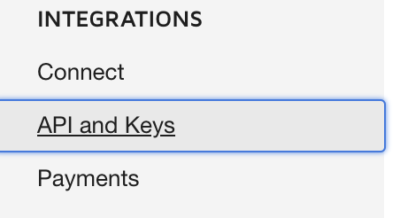
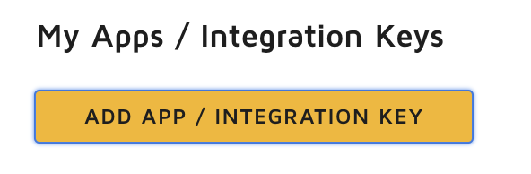
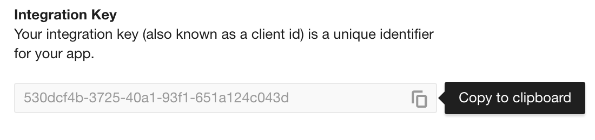
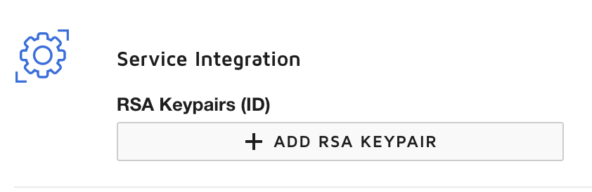
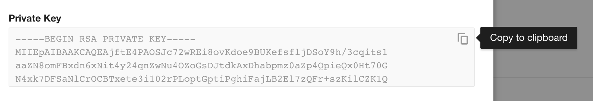
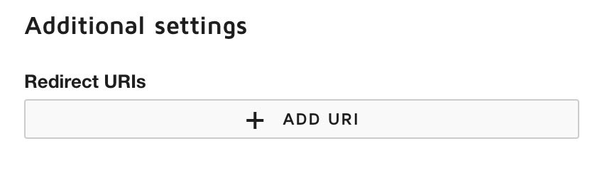
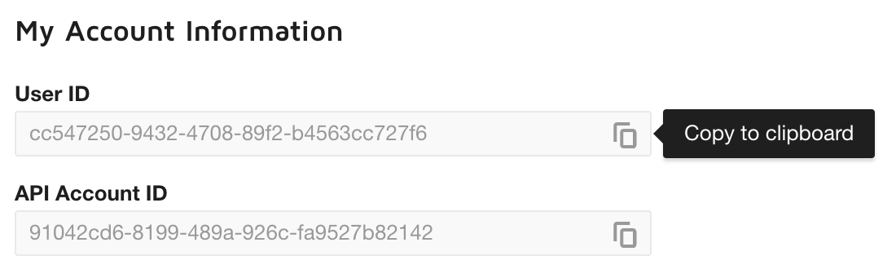

# DocuSign configuration

## Types of signatures

- **Embedded Signature**: Allow to sign a document from a website or a mobile app by being redirected to DocuSign the sent back to the website or mobileApp
- **Remote Signature**: Send an Email to ask for a document signature.
- **Clickwrap Signature**: Allow to sign a document by a single click (for example: "Terms and Conditions").

## Format restrictions:

| TYPE | EXTENSION |
|------:|:----------|
|DOCUMENT | .doc, .docm, .docx, .dot, .dotm, .dotx, .htm, .html, .msg, .pdf, .rtf, .txt, .wpd, .xps |
|IMAGE | .bmp, .gif, .jpg, .jpeg, .png, .tif, .tiff |
|PRESENTATION | .pot, .potx, .pps, .ppt, .pptm, .pptx |
|SPREADSHEET | .csv, .xls, .xlsm, .xlsx |

| RECOMMENDATION  |  SPEC |
|----------------:|:------|
|MAXIMUM FILE SIZE | 25 MB |
|RECOMMENDED FILE SIZE | 5 MB |
|MAXIMUM # PAGES PER DOCUMENT | 2,000 pages |

## Add an integration key on DocuSign

First go and authenticate yourself in `https://admindemo.docusign.com`

1. In DocuSign Admin, click API and Keys. 
1. Click `ADD APP` / `INTEGRATION KEY`. 
1. Add a name for your app, then click ADD. 
1. Select an authentication type:
    - **JSON Web Token Grant (Service Integration)** - This is used for a service integration which integrates directly with a DocuSign account. It requires an RSA keypair.
        - Create an RSA keypair.
          To generate a new keypair, click `ADD RSA KEYPAIR`. 
          **Important:** Copy the RSA keys to a secure location immediately after you create them. Secret keys and RSA keys are displayed in plain text only once: when they are first created. After that, for security purposes, DocuSign only shows the last 4 digits of any secret keys or the RSA Keypair ID of any keypairs generated. Secrets should be stored securely within your application. They should never be shared or disclosed publicly.
          
1. Click `ADD URI` and enter a `Redirect URI` for your application. When your application sends an authorization request to DocuSign, it includes the `Redirect URI` in the request. The Account Server verifies that the URI in the request and the URI in the application registration match and sends a request to this URI to continue the process. Your application can have more than one redirect `URI`. 
    **The URI must match the exact same URI of your application, without the last `/`.**
1. Click `SAVE`. Your integration key is generated and added to the list of keys. 

Set Your private key into `%kernel.project_dir%/var/jwt/docusign.pem`.
This path is configurable as following:

```yml
# config/packages/docusign.yml

docusign:
    # Authentication credentials to log into docusign.
    auth_jwt:
        private_key: "Path/To/Your/PrivateKey.pem"
        integration_key: "YourIntegrationKey"
        user_guid: "YourUserId"
        grant_type: authorization_code # Grant type (authorization_code or implicit)
```

Next: [Configure the bundle](configure-the-bundle.md)

[Go back](/README.md)
